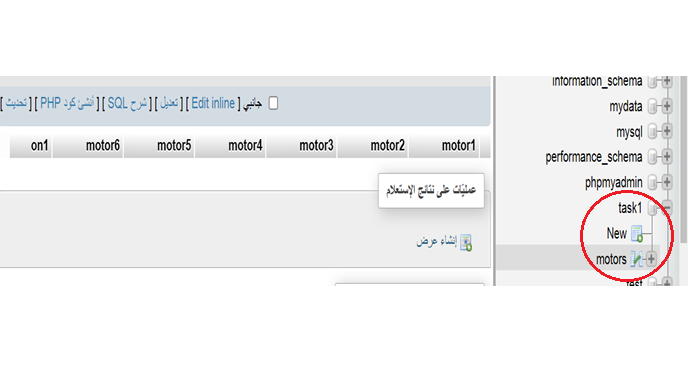
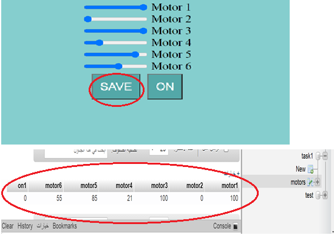
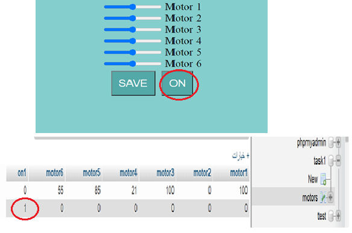

# IoT_Task1
## Interface design 

use programs to design the interface (I used Visual Studio)   

## Create a database
1-create a database (I named 'task1')  
2-create a table inside the database( I named 'motors')  
3-Add the columns  

## Connecting the database with the motors interface
Connect the code with the data then run it. 
Run the motor slider 
 
Run the ON button 

