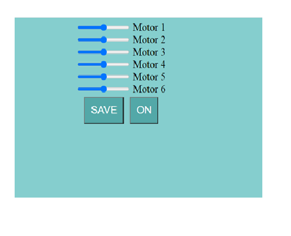

# IoT_Task1
## Interface design 

use programs to design the interface (I used Visual Studio)   

## Create a database
1-create database (I named 'mydata')  
2-create a table inside the database( I named 'panel')  
3-Add the columns  

## Connecting the database with the control interface
Connect the code with the data then run it. 

